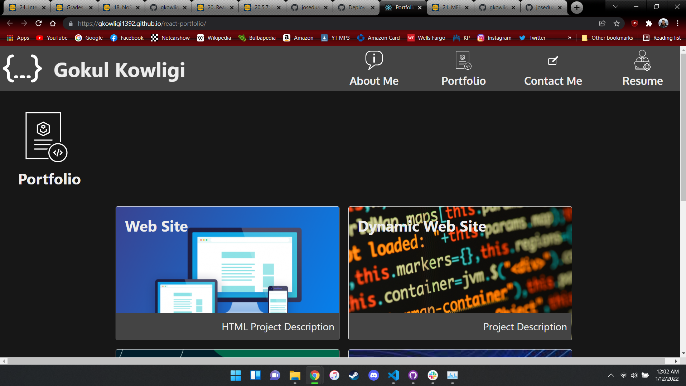

# React Portfolio

## Description

A simple react portfolio using SPA.

## Table of Contents

- [Usage](#usage)
- [Questions](#questions)
- [License](#license)

## Usage

Please visit the project url at https://gkowligi1392.github.io/react-portfolio/

## Contributing

You can participate in this project, submitting bugs and feature requests. Also, you can help testing this project using jest.

## Questions

For any questions, feel free to contact me at gkowligi@gmail.com

Checkout my [GitHub profile](https://github.com/gkowligi1392)

## License

Code released under the MIT License [License](https://choosealicense.com/licenses/mit/).
For additional questions, please feel free to contact us via email at gkowligi@gmail.com